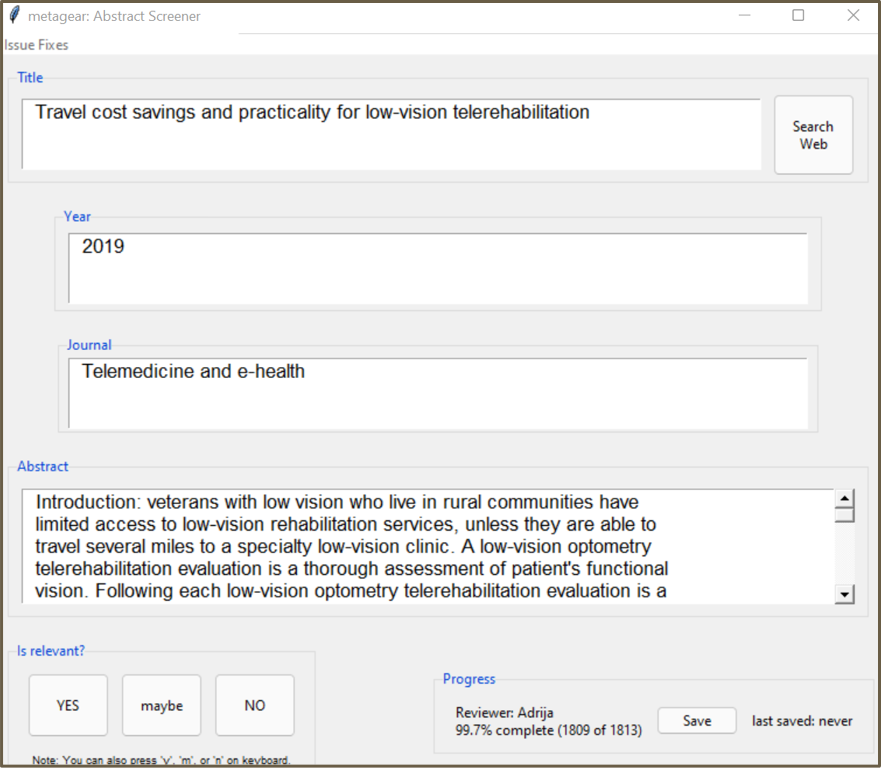

```{r setup, include=FALSE}
knitr::opts_chunk$set(echo = TRUE)
library(here)
```

# 1.	Overview


This document puts forth the functionalities for facilitating search strategy development, bibliographic database search and screening of references for systematic review using R. This also includes GUI (Graphical User Interface) to help screen the abstracts and titles of references, functionalities to assign screening effort across multiple reviewers and tools to automate the download of journal PDF articles from online databases.  
This document will be updated from time to time based on inferences, package updates and any other relevant information.  

The topic for systematic review will be " Telemedicine in secondary healthcare: a multidimensional systematic review". 

Aim: "Leveraging R for literature search: experiences from a multidimensional systematic review on telemedicine in secondary healthcare"

Our main goals are to:

-	Create Boolean search string 
-	Search the bibliographic database using the Boolean search string
-	Remove the duplicate records
-	Assign the screening effort across multiple reviewers
-	Familiarize with the GUI 'Abstract Screener'
- Get the PDF of journal articles

### Requirements

-	R
-	RStudio

*Note: When you install an R package that needs compilation, install the binary version, if you do not have the compilation tool installed in your computer.*

# 2.	Development of Boolean Search String

To create a Boolean search string, we do naïve search in bibliographic databases and systematically extract all the potential keywords from the bibliographic data we obtain. Then we will group the important keywords in to concept groups and create a Boolean search string. 

### i.	Get Data from Bibliographic Databases

We can perform naive search in different online medical databases and get data preferably in `.bib` or `.txt` format. Then by using the package `synthesisr` we can read and merge the files in to a single data frame. 

```{r cache=TRUE}
#Install the package ‘synthesisr’
if(!require("synthesisr")) install.packages("synthesisr")

#Load the package ‘synthesisr’
library(synthesisr)
```

In this example, we use the search terms 'telemdicine' and 'secondary healthcare', to perform naive search in the medical databases 'pubmed' and 'web of science,' to obtain references of studies published between 2010 and 2020.

*Note: When saving results from PUBMED, choose the 'Format' as 'PubMed'.*

*When saving results from WOS, select the 'full records' option.*

After we save the bibliographic data files in our computer, we need to import the saved files to R. 

The code below demonstrates how to read and assemble bibliographic data files. 

```{r cache=TRUE}
#List the bibliographic data files that we want to import
allfiles <- list.files(here("final_results_10yrs_pubTIAB_WOSTI&AB"),full.names = TRUE)
#Note: Here,the bibliographic data files were saved in to a file folder named 'naive_results_economic'.

#Print the listof bibliographic data files
print(allfiles)

```
# Citation
```{r}
# allfiles_c <- list.files("C:/Users/User/Documents/telemedicine/tele_cost",full.names = TRUE)
# print(allfiles_c)
# imported_files_c <- synthesisr::read_refs(
#   filename = allfiles_c,
#   return_df = TRUE)
# 
# #Find the number of records we obtained
# nrow(imported_files_c)
# 
# write.csv(imported_files_c, "./tele_cost_wos_search.csv")
# names(imported_files_c)
```

```{r cache=TRUE}

#Read the bibliographic data files and convert to a data frame
imported_files <- synthesisr::read_refs(
  filename = allfiles,
  return_df = TRUE)

#Find the number of records we obtained
nrow(imported_files)
```
```{r}
#Select the required variables
imported_files_selected <- imported_files[,c("title","abstract","keywords")]
```

### ii. Remove Duplicate Records

Now we need to remove the duplicate records. First, we can remove the duplicate articles with identical titles.

```{r cache=TRUE}
#Remove duplicate records with identical titles
remove_dupTitles <- synthesisr::deduplicate(
  imported_files_selected,
  match_by = "title",
  method = "exact"
)

#Find the number of records
nrow(remove_dupTitles)
```

Now we have a data set with de-duplicated records. Still, we need to find out if there are any additional duplicate articles in our data set. For that, we can run the following script. 
```{r cache=TRUE}
#We use string distance method to identify likely duplicates
duplicates_string <- synthesisr::find_duplicates(
  remove_dupTitles$title,
  method = "string_osa",
  to_lower = TRUE,
  rm_punctuation = TRUE,
  threshold = 5
)
```

By running the above script, we got a data set with titles which are likely duplicates. But before we remove any articles, it is always advised to manually review the titles, to confirm that they are duplicates. Also we can extract the line numbers of the records that are likely duplicates.
```{r  eval=FALSE, cache=TRUE}
#To view the records that are likely duplicates 
manual_check <- synthesisr::review_duplicates(remove_dupTitles$title, duplicates_string)
#View(manual_check) 
```

On reviewing the data set of likely duplicates, if we do not find any unique titles, i.e, if we find duplicate titles for all the records, we can run the following script.
```{r cache=TRUE}
#Extracting unique references by comparing the main data set and the data set of likely duplicates
naiveresults <- synthesisr::extract_unique_references(remove_dupTitles,duplicates_string)

#Number of records after removing the duplicates
nrow(naiveresults)
```

On reviewing the data set of likely duplicates, if we find any title(s) which is unique, we do not want to remove it. We can use the 'override_duplicates' function to mark it as unique. Only after that, we can extract the unique references by comparing the main data set and the data set of likely duplicates. 
```{r}
#Mark the record with line number '22' as unique
#new_duplicates <- synthesisr::override_duplicates(duplicates_string,22)

#Extracting unique references by comparing the main data set and the new data set of duplicates
#naiveresults <- synthesisr::extract_unique_references(remove_dupTitles,new_duplicates)
```
*Note: In our data set of likely duplicates, we could not find any titles which are unique. So we are skipping the above code lines. But in your data set, if you find any records which are unique, you must run the above script so that the unique references will not be deleted.*


### iii.	Identify Potential Keywords

Now we need to identify the potential keywords from de-duplicated records. For that, we can use the functions from the package `litsearchr`.

```{r cache=TRUE}
#Install the package 'litsearchr'
#devtools::install_github("elizagrames/litsearchr")

#Load the package 'litsearchr'
library(litsearchr)
```

The `extract_terms` function of the package `litsearchr` will systematically extract all potential keywords from the article titles, abstracts, or other fields that are passed to the function as text.

```{r message=FALSE, warning=FALSE, cache=TRUE, results='hide'}
#Extract all potential keywords from article titles and abstracts
rakedkeywords <-
  litsearchr::extract_terms(
    text = paste(naiveresults$title, naiveresults$abstract),
    method = "fakerake",
    min_freq = 2,
    ngrams = TRUE,
    min_n = 2,
    language = "English"
  )

#Extract the author/database-tagged keywords.
taggedkeywords <- litsearchr::extract_terms(keywords = naiveresults$keywords, ngrams = TRUE, min_n=1,method="tagged",language = "English")

```
### iv.	Build the Keyword Co-Occurrence Network

We run a series of functions to create a co-occurrence network and then identify the potential keywords.
```{r cache=TRUE}
#Create keyword co-occurance network
all_keywords <- unique(append(taggedkeywords, rakedkeywords))

naive_dfm <-
  litsearchr::create_dfm(
    elements = paste(naiveresults$title, naiveresults$abstract),
    features = all_keywords
  )
naivegraph <-
  litsearchr::create_network(
    search_dfm = as.matrix(naive_dfm),
    min_studies = 2,
    min_occ = 2
  )
```

### v.	Identify Change Points in Level of Importance of Keywords

The keyword co-occurrence network can next be quantitatively assessed to detect a cut-off point for changes in the level of importance of a particular keyword to the concept. This will help in making an efficient but comprehensive search by removing terms that are not central to a field of study.

```{r cache=TRUE}
cutoff <- litsearchr::find_cutoff(naivegraph, method = "cumulative", percent = .80,imp_method = "strength")

reducedgraph <- litsearchr::reduce_graph(naivegraph, cutoff_strength = cutoff[1])

searchterms <- litsearchr::get_keywords(reducedgraph)

#Display the first 20 keywords
head(searchterms,20)
```
```{r results='hide'}
#saving the search terms to a .csv file
write.csv(searchterms, "./tele_pol_impl_terms.csv")

#Display all the keywords
searchterms 
```
### vi.	Group Terms in to Similar Concept Groups

Now that the important keywords for the search have been identified, they can be grouped into blocks to build the search strategy. For Boolean searches, terms are grouped into similar concept groups where they can be combined with "OR" statements and the separate blocks combined with "AND" statements.

It is recommended to save the search terms to a `.csv` file, adding a new column called "group", and entering the group names in it, then reading in the .csv file. Although this can be done in R, adding tags to 400+ suggested search terms is generally quicker in a `.csv` file.

In our example, all keywords that relate to telemedicine would be in a similar concept group (e.g., “mobile health care system”, “telehealth” etc.) while terms related to secondary healthcare (e.g. “specialist care”, etc.) and health economics (e.g. " economic evaluation" , " cost effectiveness analysis") would be in their own concept groups each. Terms that fit multiple concept groups can be added to both without changing the logic of the Boolean connections. 

```{r cache=TRUE}
#Import the csv after making the necessary changes
grouped_terms <- read.csv("./tele_economic_terms_screened.csv")

#Extract the ‘congenital HD’ terms from the csv
telemedicine_terms <- grouped_terms$x[which(stringr::str_detect(grouped_terms$group, "Telemedicine"))]

#Join together a list of manually generated ‘congenital HD’ terms with the ones from the csv
#Note: Manually generated terms are the terms which we think, are important keywords; but are not present in the .csv file
# telemedicine <- unique(append(c("tele-ophthalmology","tele-radiology","tele-mental health","tele-pathology","tele-dentistry","tele-cardiology","tele-oncology","tele-rehabilitation"), as.character(telemedicine_terms)))

telemedicine <- unique(as.character(telemedicine_terms))

#Extract the ‘pulse oximetry’ terms from the csv
economic_terms <- grouped_terms$x[which(stringr::str_detect(grouped_terms$group, "Economic"))]

#Join together a list of manually generated ‘pulse oximetry’ terms with the ones from the csv. If there are no manually generated terms, we can simply use the terms from the csv.
# application <- unique(append(c("use*","advantage","usage","benefit"),as.character(application_terms)))

economic <- unique(as.character(economic_terms))

#Note: Repeat this for all concept groups

#Then merge them into a list
mysearchterms <- list(telemedicine,economic)
```

### vii.	Write Boolean Searches

Once keywords are grouped into concept groups in a list, the `write_search` function can be used to write Boolean searches in multiple languages. The script below demonstrates writing a search in English using the search terms.
```{r cache=TRUE}
#Generate Boolean search string
boolean_string <- litsearchr::write_search(
  groupdata = mysearchterms,
  languages = "English",
  exactphrase = FALSE,
  stemming = FALSE,
  closure = "none",
  writesearch = FALSE,
  verbose = TRUE
)
#View the boolean search string generated
boolean_string
```

# 3.	Database Search using the Boolean Search String

### i.	Import Data from Bibliographic Database using Boolean Search String

Now using the Boolean search string developed, we can do the final search in the bibliographic databases and save the result data files in our computer. Then we need to read and merge all the files in to a single data frame and then remove the duplicate records.

*Note: When saving results from PUBMED, choose the 'Format' as 'PubMed'.*

*When saving results from WOS, select the 'full records' option in .txt format.*

 
```{r cache=TRUE}
#List the bibliographic data files after the final search
allfiles_final <- list.files(here("final_results_10yrs_pubTIAB_WOSTI&AB"),full.names = TRUE)

#Print the list of bibliographic data files
print(allfiles_final)

```

```{r cache=TRUE}
#Read the bibliographic data files and convert to a data frame
final_files <- synthesisr::read_refs(
  filename = allfiles_final,
  return_df = TRUE)

#Find the number of records we obtained
nrow(final_files)
```

```{r cache=TRUE,include=FALSE, results='hide'}
#Load the package 'dplyr'
#Required for data tidying

library(dplyr)
```

#### If only WOS files(`.txt`) are to be screened, run the following script.
```{r cache=TRUE}
final_files_selected <- final_files[,c("author_full","title","source","year","doi","abstract","language","keywords","volume")]

final_files_selected <- final_files_selected %>% dplyr::rename(journal = source)
```

#### If only pubmed files(`.txt`) are to be screened, run the following script.
```{r cache=TRUE, eval=FALSE}
#Select the required variables
filtered_final_files <- final_files[,c("author_full","title","journal","abstract","language","keywords","date_published","article_id","volume")]

#Extract the year published from pubmed records
pub_year_final <- gsub( " .*$", "", filtered_final_files$date_published)
filtered_final_files <-filtered_final_files %>% 
    dplyr::mutate(year= pub_year_final)

#Extract doi from pubmed records
before_doi_final<- sub("\\[doi].*", "", filtered_final_files$article_id)
after_and_final <- sub(".*and", "", before_doi_final)
after_and_final  <- trimws(after_and_final, which = c("left"))
filtered_final_files <-filtered_final_files %>% 
    dplyr::mutate(doi= after_and_final)

#Convert column fields with no proper doi to NA
is.na(filtered_final_files$doi) <- !(startsWith(filtered_final_files$doi, "10."))

#Select the required variables
final_files_selected <- filtered_final_files[,c("author_full","title","journal","year","doi","abstract","language","keywords","volume")]
```

#### If both pubmed(`.txt`) and wos(`.txt`) files are to be screened together, run the following script
```{r}
#Extract required variables
filtered_final_files <- final_files[,c("author_full","title","journal","source","year","doi","abstract","language","keywords","date_published","article_id","volume","filename")]

#Fill the empty column fields in 'journal'
filtered_final_files$journal <- ifelse(is.na(filtered_final_files$journal), filtered_final_files$source, filtered_final_files$journal)

#Extract the year published from pubmed records
pub_year_final <- gsub( " .*$", "", filtered_final_files$date_published)
filtered_final_files$year <- ifelse(is.na(filtered_final_files$year), pub_year_final, filtered_final_files$year)

#Extract doi from pubmed records
before_doi_final<- sub("\\[doi].*", "", filtered_final_files$article_id)
after_and_final <- sub(".*and", "", before_doi_final)
after_and_final  <- trimws(after_and_final, which = c("left"))
filtered_final_files$doi <- ifelse(is.na(filtered_final_files$doi), after_and_final, filtered_final_files$doi)

#Convert column fields with no proper doi to NA
is.na(filtered_final_files$doi) <- !(startsWith(filtered_final_files$doi, "10."))

#Select variables after data cleaning
final_files_selected <- filtered_final_files[,c("author_full","title","journal","year","doi","abstract","language","keywords","volume")]
nrow(final_files_selected)

```

Now we need to remove the duplicate records. First, we can remove the duplicate articles with identical titles.

```{r cache=TRUE}
#Remove duplicate records with identical titles
remove_dup_final <- synthesisr::deduplicate(
  final_files_selected,
  match_by = "title",
  method = "exact"
)
#Find number of records
nrow(remove_dup_final)
```

Now we got a data set with de-duplicated records. Still, we need to find out if there are any additional duplicate articles in our data set. For that, we can run the following script. 
```{r cache=TRUE}
#We use string distance method to identify likely duplicates
duplicates_string_final <- synthesisr::find_duplicates(
  remove_dup_final$title,
  method = "string_osa",
  to_lower = TRUE,
  rm_punctuation = TRUE,
  threshold = 5
)
```

By running the above script, we got a data set with titles which are likely duplicates. But before we remove any articles, it is always better to manually review the titles, to confirm that they are duplicates. Also we can extract the line numbers of the records that are likely duplicates.
```{r cache=TRUE}
#To view the records that are likely duplicates 
manual_check_final <- synthesisr::review_duplicates(remove_dup_final$title, duplicates_string_final)
#View(manual_check_final)
```

On reviewing the data set of likely duplicates, if we do not find any unique titles, i.e, if we find duplicate titles for all the records, we can run the following script.
```{r cache=TRUE}
#Extracting unique references by comparing the main data set and the data set of likely duplicates
string_res <- synthesisr::extract_unique_references(remove_dup_final,duplicates_string_final)

#Number of records after removing the duplicates
nrow(string_res)
```

On reviewing the data set of likely duplicates, if we find any title(s) which is unique, we do not want to remove it. We can use the `override_duplicates` function to mark it as unique. Only after that, we can extract the unique references by comparing the main data set and the data set of likely duplicates. 
```{r}
#Mark the record with line number '762' as unique
#new_duplicates_final <- synthesisr::override_duplicates(duplicates_string_final,762)

#Extracting unique references by comparing the main data set and the new data set of likely duplicates
#string_res <- synthesisr::extract_unique_references(remove_dup_final,new_duplicates_final)
```
*Note: In our data set of likely duplicates, we could not find any titles which are unique. Hence we are skipping the above code lines. But in your data set, if you find any records which are unique, you must run the above script so that unique references will not be deleted.*

Now we have a data set with unique references to be screened.

```{r cache=TRUE}
#The bibliographic variables in this dataset can be displayed by running the following script
names(string_res)

#Display the titles
titles<-string_res["title"]

```

# 4.	Screening of References

### i.	Delegate Reference Screening Effort to a Team

Now our goal is to distribute the screening effort to two or more reviewers. For that, we can use functions from the package `metagear`.

The `metagear` package can be installed by running the following R script
```{r eval=FALSE, cache=TRUE}
#Install the packages ‘BiocManager’ & 'EBImage'
#install.packages("BiocManager")
#BiocManager::install("EBImage")
```

```{r message=FALSE, warning=FALSE, CACHE=TRUE}
#Load the package ‘metagear’
library(metagear)
#Note: The first loading of metagear using library(metagear) will trigger the download of the gWidgets package and associated toolkits needed to build GUI interfaces. A small window will also prompt you to download GTK+ asking “Need GTK+ ?”. From the listed options answer: “Install GTK+” and click “OK”. Once installed, these will not be downloaded again.
```

In our example, we are distributing the screening efforts to three reviewers: "ReviewerA", "ReviewerB" and "ReviewerC". Each reviewer will screen a separate subset of these references.

First, we need to initialize this data set for screening tasks.
```{r cache=TRUE}
#Initialize the data set
ref <- effort_initialize(string_res)

#Display the new columns added by ‘effort_initialize’ function
names(ref)
```

Note that the `effort_initialize()` function added three new columns: "STUDY_ID" which is a unique number for each reference, "REVIEWERS" an empty column with `NAs` that will be later populated with our reviewer names, and the "INCLUDE" column, which will later contain the screening efforts by the reviewers. Screening efforts are essentially how individual study references get coded for inclusion in the synthesis project; currently the "INCLUDE" column has each reference coded as "not vetted", indicating that each reference has yet to be screened.

```{r cache=TRUE}
# Change the format of title, abstract & journal in the dataset
ref$title <- stringr::str_to_sentence(ref$title)
ref$abstract <- stringr::str_to_sentence(ref$abstract)
ref$journal <- stringr::str_to_sentence(ref$journal)
```

Next task is to delegate screening efforts to our three reviewers; ReviewerA, ReviewerB and ReviewerC.  These references will be randomly distributed to each reviewer.  For that, we can use `effort_distribute()` function.

By setting the `save_split` parameter to TRUE, the reference subset will be saved in separate files. These can be given to corresponding reviewers to start their work.

The `set.seed()` function sets the starting number used to generate a sequence of random numbers – it ensures that you get the same result if you start with that same seed each time you run the same process. 
```{r results='hide', cache=TRUE}
#Randomly distribute screening effort to three reviewers and saving the screening tasks to a separate file
team<- c("Ashis")
set.seed(123);
unscreened <- metagear::effort_distribute(ref,reviewers = team, save_split= TRUE)
#3 files will be saved in the file folder

#Display screening tasks
unscreened[c("STUDY_ID", "REVIEWERS")]

#View the files created
list.files(pattern = "effort")
#Note: It will list all the files with names starting with 'effort' in that particular folder
```
We can see three separate `effort_*.csv` files created with references to be screened. These can be passed on to the corresponding team member so that they can begin the screening of references.

In case, we do not want to distribute the screening task equally among all the team members, we also have option to distribute the task unevenly, such as below where ReviewerA will take on 60% of the screening effort and the other two reviewers 20% each:
```{r results='hide', eval=FALSE, cache=TRUE}
set.seed(123);
unscreened <- metagear::effort_distribute(ref, reviewers = team, effort = c(60,20,20))

unscreened[c("STUDY_ID", "REVIEWERS")]
```

The effort can also be redistributed with the `effort_redistribute()` function. Here we are assigning 10% of ReviewerA's work to a new team member ReviewerD.

```{r results='hide', eval=FALSE, cache=TRUE}
#Redistributing the work
#Moving 10% of ReviewerA's work to ReviewerD
set.seed(123);
ref_redistribute <- metagear::effort_redistribute(unscreened,reviewer =  "ReviewerA", remove_effort = 10, reviewers =c("ReviewerA","ReviewerD"))

#Team members loosing and picking up work
ref_redistribute [c("STUDY_ID", "REVIEWERS")]
```

### ii.	Abstract Screener

The package `metagear` offers a simple abstract screener to quickly screen the abstracts and titles of multiple references. 

Given below is the script to help initialize the GUI in R:
```{r cache=TRUE,results='hide'}
# Custom abstract screener function with year and journal added
source('abstract_screener_custom_function.R') 

# Illustration of the custom widget with Year and Journal added
abstract_screener_custom("effort_Ashis.csv",
                  aReviewer = "Ashis")

```




The GUI itself will appear as a single window with the first title/abstract listed in the `.csv` file. If abstracts have already been screened, it will begin at the nearest reference labeled as "not vetted". The YES, MAYBE, NO buttons, which also have shortcuts `ALT-Y` and `ALT-N`, are used to code the inclusion/exclusion of the reference. Once clicked/coded the next reference is loaded. References should be coded as "YES" or "NO" for inclusion, but can also be coded as "MAYBE" if bibliographic information is missing or there is inadequate information to make a proper assessment of the study. The SAVE button is used to save the coding progress of screening tasks. It will save coding progress directly to the loaded .csv file. The SEARCH WEB button opens the default browser and searches Google with the title of the reference. 
Closing the GUI without saving will result in the loss of screening efforts relative to last save.

Once the screening is complete, we have an option to merge the three files with the completed screening efforts using the `effort_merge()` function, as well as summarize the outcome of screening tasks using the `effort_summary()` function.

```{r results='hide', eval=FALSE, cache=TRUE}
#Merge the screened studies, effort_ReviewerA.csv, effort_ReviewerB.csv and effort_ReviewerC.csv
#WARNING: will merge all files named "effort_*" in directory
screened <- effort_merge()
screened[c("STUDY_ID", "REVIEWERS", "INCLUDE")]
theSummary <- effort_summary(screened)
```

The summary of screening tasks describes which references are appropriate, while also outlining which need to be re-assessed. The team should discuss these references and decide if they are appropriate for inclusion or track down any additional/missing information needed to make proper assessment of their inclusion.

# 5.	Download the PDF of Journal Articles

Once the references have been screened, we can download the `PDF` articles of selected references by using the `metagear` package. 
First, we can extract the selected references from the screened `.csv` file by using the following script.

```{r eval=FALSE, cache=TRUE}
#Read the .csv file with screened references
vetted <- read.csv("./effort_Ashis_tele_economic_evaluation_screened.csv")

#Select only the selected references
selected_ref <- subset(vetted,INCLUDE=='YES')

selectedRefs_download <- selected_ref[,c("author_full","title","journal","year","doi","abstract","language","keywords","volume")]
```

Now we have a `.csv` file with only the selected references. By using this file, we can download the `PDF` articles by running the following R script.

*Note that the download success of these PDFs is entirely conditional on the journal subscription coverage of the host institution running metagear. Also note that metagear only supports the download of a PDF article if the DOI (digital object identifier) is available for that article.*
```{r eval=FALSE,cache=TRUE}

#Extract last name of author
last_name<- sub("\\,.*", "", selectedRefs_download$author_full)

#Add extracted last name to dataset
selectedRefs_download <-selectedRefs_download %>% 
    mutate(last_name= last_name)

#Combine the title,lastname & year
selectedRefs_download$title_download <- paste(selectedRefs_download$title,selectedRefs_download$last_name,selectedRefs_download$year,sep=";")

#Create a directory where the downloaded PDFs will be saved
dir.create("PDF_downloads_economic_jio")

#Fetch the PDFs
collectionOutcomes <- metagear::PDFs_collect(selectedRefs_download, DOIcolumn = "doi", FileNamecolumn = "title_download", directory = "PDF_downloads_economic_jio",quiet = TRUE)
#Note: 'Column name of DOIs in your data set must be assigned to the variable 'DOIcolumn'

#Check the download success
table(collectionOutcomes$downloadOutcomes)
```

# 6.	Load References in Zotero

We can load the selected references in Zotero and use all the functionalities of Zotero to manage our selected references. We can use the functions of the package `zoteror` to access the Zotero API and then load our references in Zotero.
```{r CACHE=TRUE}
#Install & load the package 'zoteror'
if(!require("remotes")) install.packages("remotes")
#remotes::install_github(repo = "giocomai/zoteror")

#Load the package 'zoteror'
library(zoteror)
```

To create a Zotero API, we need to log in to zotero website, go to the (Feeds/API page in Settings)[https://www.zotero.org/settings/keys], and create an API from there. The API created will be set as `credentials` in our R script.

```{r eval=FALSE, CACHE=TRUE}
#Store credentials
#Note: Instead of inputting user and credentials each time a function is run, it is easier to set them with 'ZotSetOptions' at the beginning of every session.
zot_set_options(user = 6574132, credentials = "RVpzjCu9nqwwTBNrTt8aRQlP")

#Note: user will be your user ID & credentials will be your API Key created. To execute the above script, you need to provide your user ID and API key created.
```

Now we can create a new collection in Zotero by the given name, and outputs its key. If a collection with the same name already exists, it does not create a new one, but rather outputs the key of the pre-existing collection. The function `zot_create_collection()` requires an API key with write access.
```{r eval=FALSE, CACHE=TRUE}
#Load the package 'tibble'
library(tibble)

#Create a collection 
key <- zot_create_collection(collection_name = "References")
#Note: key_CHD contains the key of the collection created
```

Now on opening the Zotero, we can see a new folder created in the given name. At present, the folder will be empty. Now we can load our references in that folder by running the following R script.
```{r eval=FALSE,CACHE=TRUE}

#Read the .csv file with screened references
vetted <- read.csv("./effort_ReviewerA_screened.csv")

#Select only the selected references to be loaded in Zotero
zotero_items <- subset(vetted,INCLUDE=='YES')


#Transform our reference data frame in to a format that fully mirrors Zotero's data structure
library(tidyverse)
zotero_items_formatted <- 
  zotero_items %>% 
  mutate(itemType= 'journalArticle',title=title,abstractNote=abstract,
         creators = zot_convert_creators_to_df_list(creator = author_full,creator_type = "author",separator_multiple_authors = " and ",separator_surname_name = ", "), 
         publicationTitle = journal, volume = volume, language = language, date = year, DOI=doi)
```

```{r eval=FALSE, results='hide', CACHE=TRUE}
#Create a dataframe with required fileds to be loaded in Zotero
df = zotero_items_formatted[c("itemType","title","abstractNote","creators",
    "publicationTitle","volume","language","date","DOI")]

#Upload the items in Zotero
zot_create_items(item_df = df, collection = "References")

```


Now, on checking the Zotero, we can find the items have been loaded. We can right-click on the items and select 'Find available PDF' to get the PDF of the articles. If PDF is not available for download, there is an option to view the articles online.


# 7.	References

## i.	CRAN.R - Packages Documentation

a.	Metagear Package - Documentation

URL : https://cran.r-project.org/web/packages/metagear/metagear.pdf

b.	Synthesisr Package – Documentation

URL : https://cran.r-project.org/web/packages/synthesisr/synthesisr.pdf


## ii.	GitHub Repo 

a.	Litsearchr Package

URL : https://github.com/elizagrames/litsearchr

b.	Zoteror Package

URL: https://github.com/giocomai/zoteror


